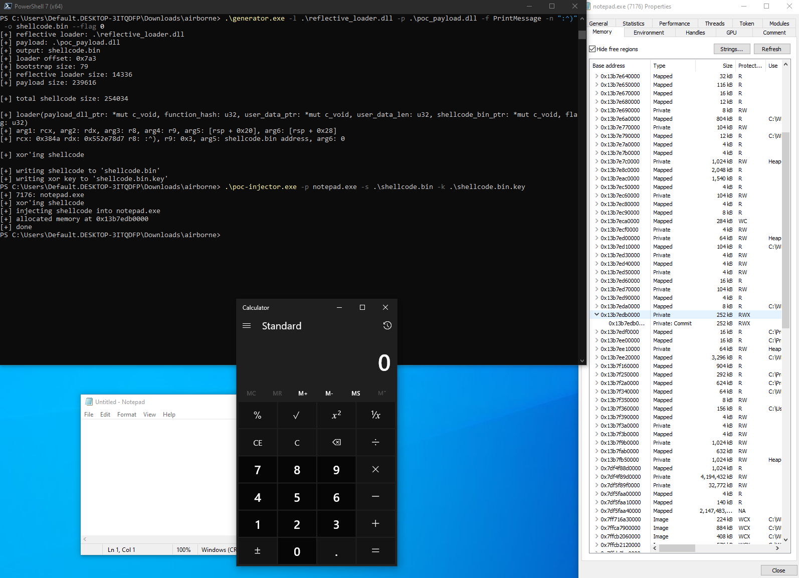

# Shellcode reflective DLL injection in Rust

Reflective DLL injection demo for fun and education. In practical applications, there's significant scope for enhancing build sizes, obfuscation, and delivery logic.

[A blog post describing the technicalities of sRDI.](https://golfed.xyz/blog/understanding-srdi/)

### Project Structure

```shell
.
├── generator           # Shellcode generator (ties together bootstrap, loader, payload, and user data)
├── injector            # PoC injector (CreateRemoteThread)
├── payload             # PoC payload (calc.exe or MessageBoxW based on generator's flag)
├── reflective_loader   # sRDI implementation
└── utils               # Common XOR and hashing functions
```

### Features

- ~14 kB reflective loader
- Hashed import names & indirect function calls
- XOR encrypted payload shellcode
- Shuffled and delayed IDT iteration (during IAT patching)

### Usage

The following command compiles the DLLs and executables into `target/release/`:

```shell
$ cargo build --release
```

1. Generate shellcode containing the loader and the payload:

```
Usage: generator.exe [OPTIONS] --loader <LOADER_PATH> --payload <PAYLOAD_PATH> --function <FUNCTION_NAME> --parameter <PARAMETER> --output <OUTPUT_PATH>

Options:
  -l, --loader <LOADER_PATH>      Path to the sRDI loader DLL
  -p, --payload <PAYLOAD_PATH>    Path to the payload DLL
  -f, --function <FUNCTION_NAME>  Name of the function to call in the payload DLL
  -n, --parameter <PARAMETER>     Parameter to pass to the function
  -o, --output <OUTPUT_PATH>      Path to the output file
  -f, --flag <FLAG>               Flag to pass to the loader (by default DllMain is called) [default: 0]
  -h, --help                      Print help
  -V, --version                   Print version
```

2. Inject the created shellcode into target:

```
Usage: poc-injector.exe -p <PROCESS_NAME> -s <SHELLCODE_PATH> -k <KEYFILE_PATH>
```

3. Depending on the flag passed to the generator, either payload's `DllMain` with `DLL_PROCESS_ATTACH` or user defined function will run:

<div align="center">
    
    
</div>

### Disclaimer

Information and code provided on this repository are for educational purposes only. The creator is in no way responsible for any direct or indirect damage caused due to the misuse of the information.

### Credits

- Stephen Fewer ([@stephenfewer](https://github.com/stephenfewer)) for reflective DLL injection
- Nick Landers ([@monoxgas](https://github.com/monoxgas)) for shellcode generator
- [@memN0ps](https://github.com/memN0ps) for bootstrap shellcode
